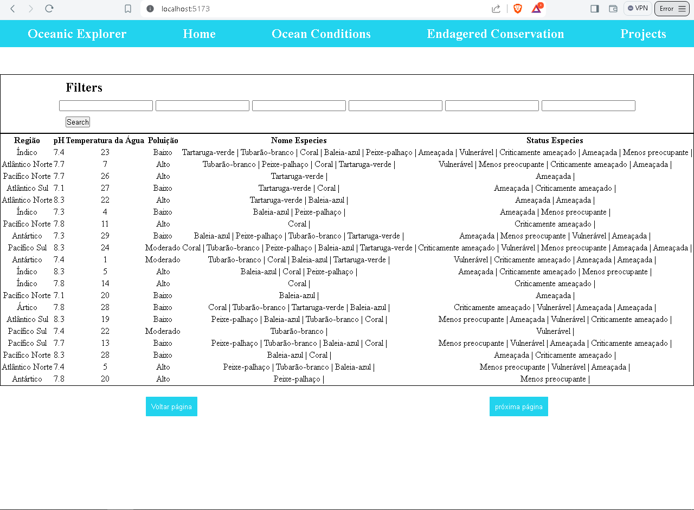

# Membros da equipe

## Guilherme Muniz Viana RM:92954
## Nikolas de Oliveira Paspaltzis RM:92865
## Pedro Eduardo Pereira de Oliveira RM:84556
# Tecnologias utilizadas:
## React
## Styled-components
## Vite
## NPM

## Ao clonar o projeto é necessário rodar o comando npm i (ou npm install)
## Em seguida usar npm run dev

